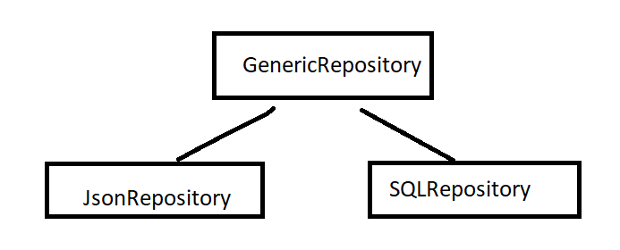
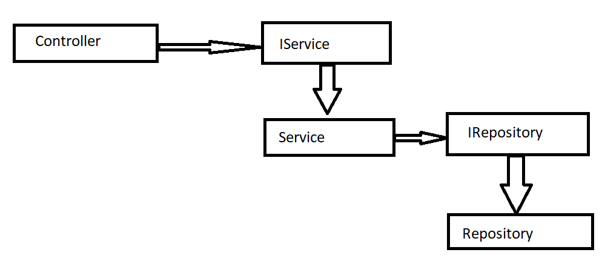

# BookCatalog

## Description
BookCatalog is .NET Core REST API application implemented with basic Domain Driven Design.

## Technologies implemented:

- .NET Core 5.0
- .NET Core Native Dependency Injection
- AutoMapper
- Swagger (for API documentation)
- Rabbit MQ
- xunit Unit Tests
- Serilog

## Architecture: [Clean Architecture](http://blog.cleancoder.com/uncle-bob/2012/08/13/the-clean-architecture.html)

- Full architecture with Responsibility Separation Concerns, SOLID and Clean Code
- Domain Driven Design 
- Repository (and Generic Repository) Backend: Json

## How start

1. Clone this repository
2. Restore packages in NuGet 
3. Build project
4. Run project 

## About:
The Book Catalog Project was developed by [Seetha R Chimakurthi], seetha.chimakurthi@gmail.com.
